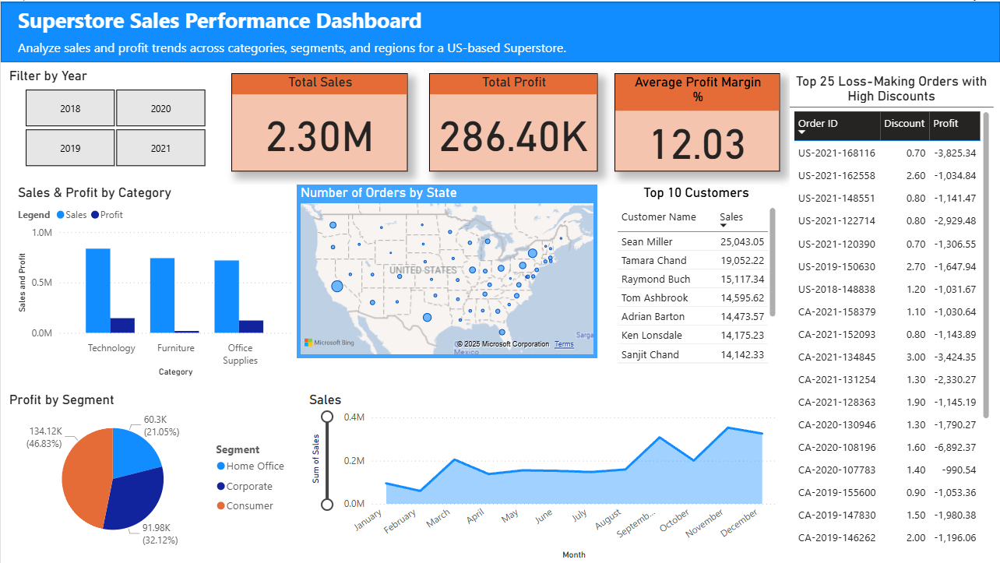

# 📊 Superstore Sales & Profit Analysis — SQL + Power BI Project

This end-to-end data analysis project explores a fictional retail dataset to uncover actionable business insights using **SQL (via DBeaver)** for data wrangling and **Power BI** for dynamic visualization. The goal is to analyze key performance areas such as **sales trends**, **regional profitability**, **customer behavior**, and **shipping efficiency**.

## 🗂️ Dataset Overview

- **Source:** Tableau Sample Superstore Dataset  
- **Format:** Excel (.xls), converted to CSV for SQL ingestion  
- **Records:** ~10,000 orders  
- **Fields:** 21 (e.g., Order ID, Category, Sales, Profit, Customer ID)  
- **Tools Used:** DBeaver (SQLite), Power BI, Excel

## 🧠 Skills Demonstrated

- Writing complex SQL queries in **DBeaver** using **SQLite**
- **Time-series analysis** using `STRFTIME`
- **Profitability and margin analysis** by various dimensions
- **Data cleaning** and transformation
- Creating **interactive Power BI dashboards** with filters, slicers, and drill-downs
- Business storytelling and insight generation

## 🧾 SQL Query Highlights

> 📁 All SQL queries are saved in [`/queries/Script.sql`](./queries/Script.sql)

Structured into 6 main themes:

### 1. 📈 Sales & Profit Analysis
- Total Sales, Profit, and Profit Margin
- Sales & Profit by Category, Sub-Category, Region, and Top 5 States

### 2. 📅 Trends Over Time
- Monthly and Quarterly Sales Trends
- Yearly Profit Margins

### 3. 🧍 Customer Behavior
- Top 10 Customers by Sales
- Segment-wise Order Count and Profitability
- Average Order Value per Segment

### 4. 📦 Product Insights
- Best & Worst Products by Quantity and Profit Margin
- Sub-Category Discounts vs. Profitability

### 5. 🚚 Shipping & Operations
- Shipping Delay by Mode
- Orders and Profit by Ship Mode

### 6. 💸 Discounts & Profitability
- High Discount & Negative Profit Orders (loss-makers)

## 📊 Power BI Dashboard Preview

>📁 Find the Power BI report in [`/dashboard/Superstore_Sales_Dashboard_Praveen.pbix`](./dashboard/Superstore_Sales_Dashboard_Praveen.pbix)

### Dashboard Features:
- 💰 **KPIs:** Total Sales, Total Profit, Average Profit Margin
- 🌍 **Region-wise Sales & Profit**
- 📦 **Top 10 Products & Sub-Categories**
- 🕒 **Sales Trends (Monthly/Quarterly)**
- 🧍 **Customer Segment Performance**
- ⚠️ **Top 25 Loss-Making Orders with High Discounts**

## 🛠️ Tools & Technologies

| Tool        | Purpose                            |
|-------------|-------------------------------------|
| **DBeaver** | SQL querying (SQLite)               |
| **Power BI**| Dashboard creation                  |
| **Excel**   | Data formatting                     |
| **GitHub**  | Version control and documentation   |

## ✅ Key Business Insights

- 📌 **Furniture** category had lower profit margins despite high sales
- 📌 **Consumers** remain the most profitable segment of customers consistently across all 4 years
- 📌 **Western region** was the top contributor to sales, with the majority of orders coming from California
- 📌 Some high-discount orders, particularly over 30% consistently resulted in **losses**
- 📌 **Standard Class** shipping had the most orders but longest delays
- 📌 Sales had a consistent positive spike in Q3 and Q4 across all four years

## 🚀 What I Learned

- How to use **SQL** for real-world data slicing and trend analysis  
- How to use **Power BI** for developing dashboards
- Importance of **visual storytelling** in business intelligence  
- How to tie together SQL and visualization tools for end-to-end analysis  
- How operational factors (shipping, discounting) directly affect profitability  
